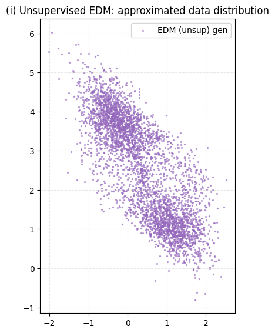
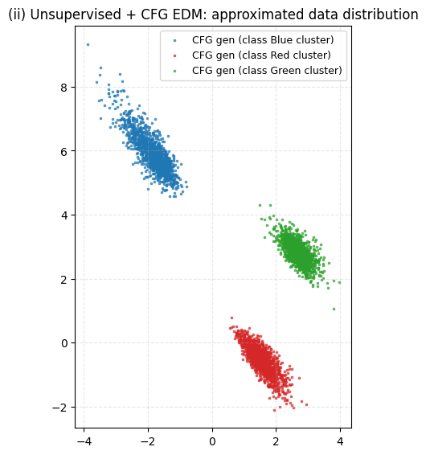
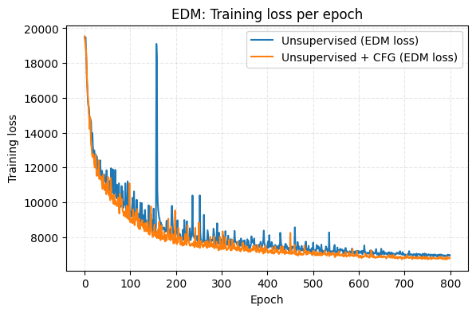

Essentially Elucidating Diffusion Model with reserve-time SDE, which is also related Ornstein-Ulhenbeck (OU) process, where I implemented Algorithm 2 from the paper

## Unsupervised setting
 

## Semisupervised setting

## Training Loss for denoising matching loss function

