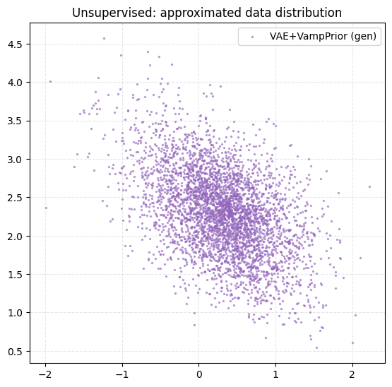
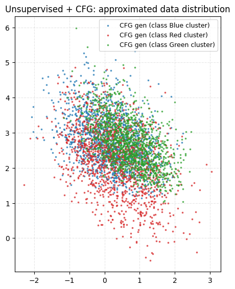
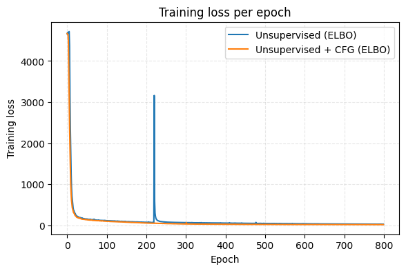

Hierarchical of 2 VAEs with Mixture of Gaussians as prior, see alternative priors in ``VAE with a VampPrior`` paper

## Unsupervised setting
 

## Semisupervised setting

## Training Loss for denoising matching loss function

