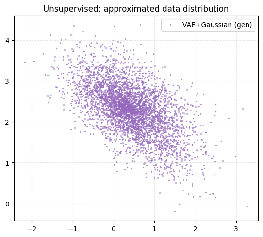
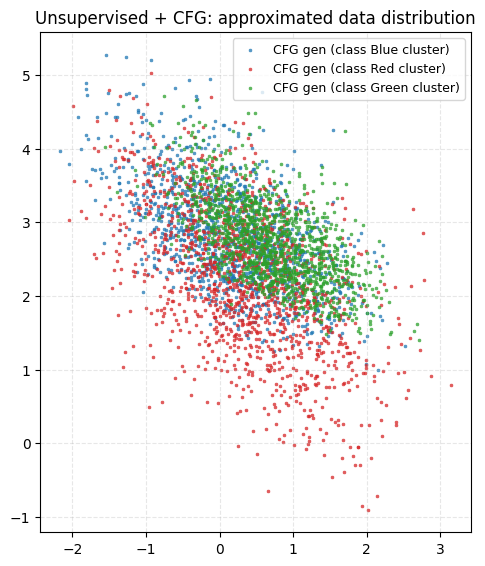
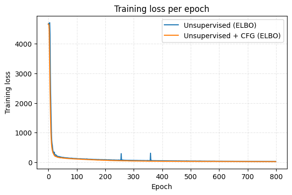

Classical VAE by Kingma 2013 is a hierarchical of 1 VAE with normal distribution as prior

## Unsupervised setting
 

## Semisupervised setting

## Training Loss for denoising matching loss function

